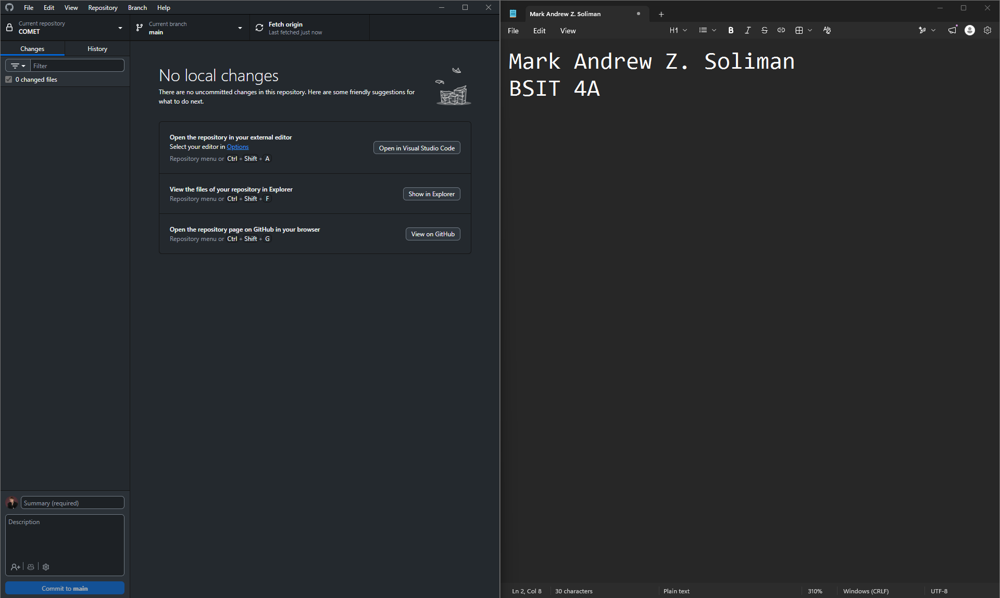
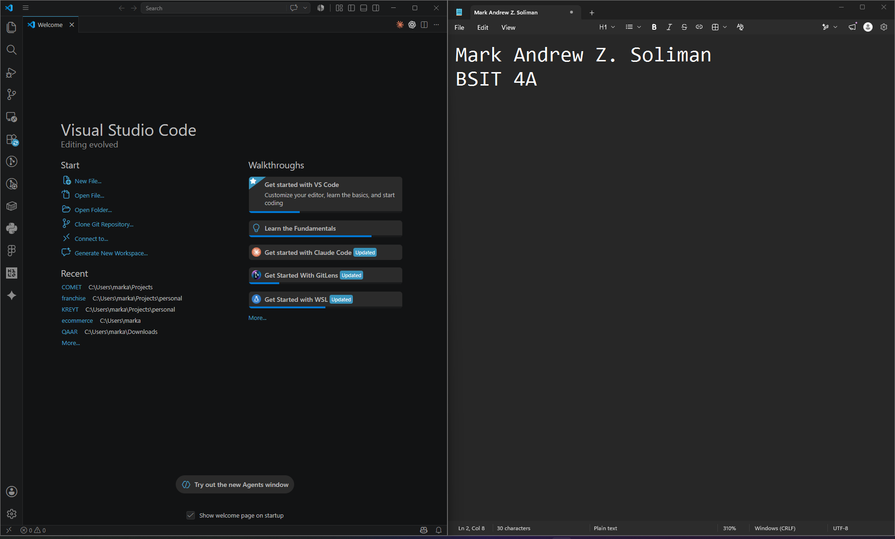
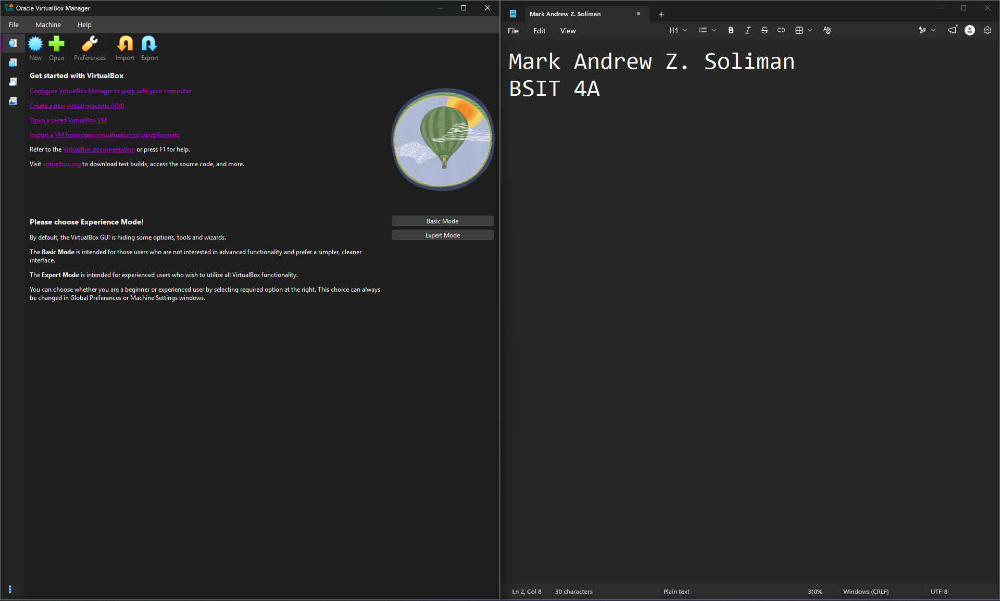
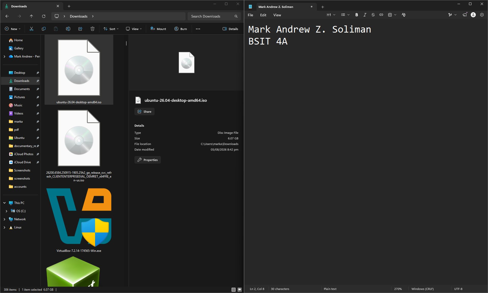
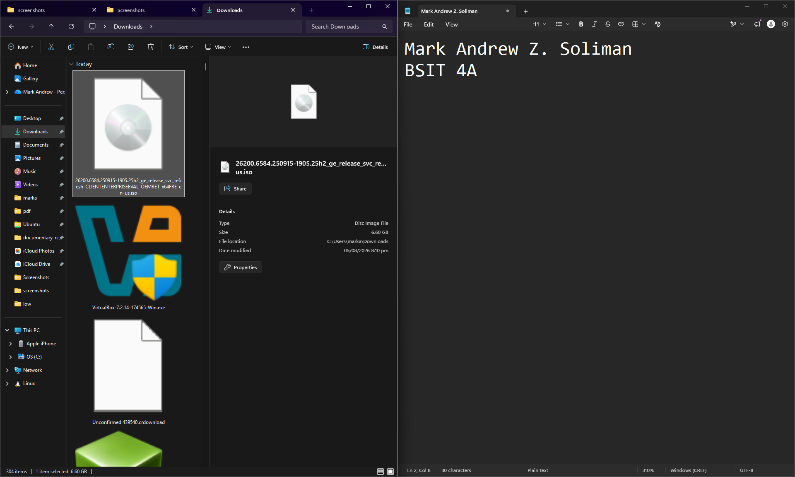

# Week 1 – Building My Professional Environment
## Student Information
- Name: Mark Andrew
- Course: BSIT
- Section: BSIT-1A
- Date: August 5, 2026

# Objectives
- To install all required software development and virtualization tools.
- To configure the computer for future laboratory activities.
- To create professional online accounts for learning and collaboration.
- To create and organize a GitHub portfolio repository.
- To publish the first technical documentation using Markdown.
- To create a professional LinkedIn post describing my learning journey.

---
# Software Installed
- Git
- GitHub Desktop
- Visual Studio Code
- VirtualBox
- Ubuntu Desktop/Server ISO
- Windows 11 Enterprise Evaluation ISO
- Google Chrome / Microsoft Edge

---
# Professional Accounts
- GitHub: https://github.com/mrkndrwslmn
- LinkedIn: https://linkedin.com/in/mark-andrew

---
# Installation Screenshots

---
# Challenges Encountered
1. **GitHub Repository Creation**: Initially had trouble pushing the local repository to GitHub because the remote origin URL was incorrect, causing an error. I solved this by using the `git remote set-url origin` command to update the URL and then forcing the push with `git push -u origin main --force`.
2. **VirtualBox Installation Error**: Winget threw an "exit code: 1" error due to VirtualBox requiring a manual agreement for network interfaces. I solved this by manually downloading the VirtualBox Windows hosts installer from their official website and installing it directly.
3. **Storage Space Limitations**: I was running low on storage with only 5GB remaining. I resolved this by clearing my temporary files, emptying the Recycle Bin, and clearing the NPM cache via the command line, reclaiming over 4GB of space.

---
# Reflection
This week's activity laid the foundation for a robust system administration workspace. By configuring these essential tools—such as Git for version control, VirtualBox for virtualization, and a code editor—I have prepared an environment capable of handling complex administrative tasks and testing configurations safely. Version control will ensure my work is systematically tracked and backed up. Additionally, creating professional profiles on GitHub and LinkedIn helps me establish my digital footprint, connecting my hands-on practice with the broader IT community. These initial steps are crucial for my development as a future System Administrator because they instill the best practices of organization, continuous learning, and professional documentation right from the start.

---
# References
- [Git Official Documentation](https://git-scm.com/doc)
- [GitHub Guides](https://guides.github.com/)
- [Visual Studio Code Documentation](https://code.visualstudio.com/docs)
- [VirtualBox Manual](https://www.virtualbox.org/manual/)
