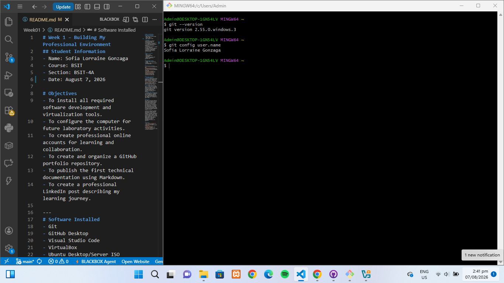
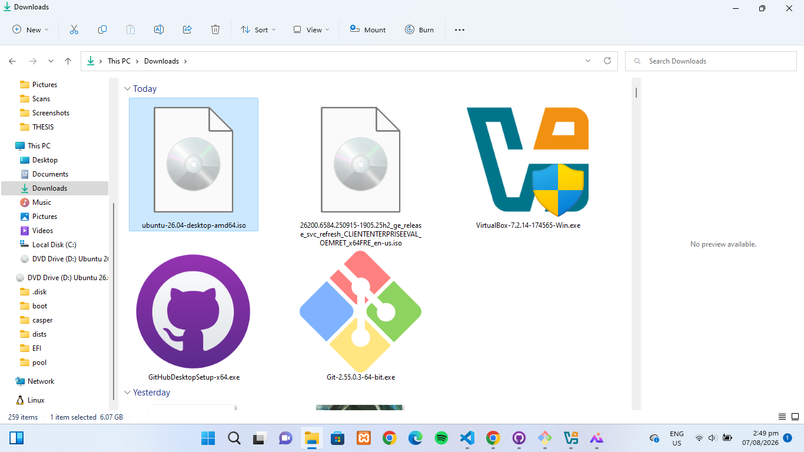

# Week 1 – Building My Professional Environment
## Student Information
- Name: Sofia Lorraine Gonzaga
- Course: BSIT
- Section: BSIT-4A
- Date: August 7, 2026

# Objectives
- To install all required software development and virtualization tools.
- To configure the computer for future laboratory activities.
- To create professional online accounts for learning and collaboration.
- To create and organize a GitHub portfolio repository.
- To publish the first technical documentation using Markdown.
- To create a professional LinkedIn post describing my learning journey.

---
# Software Installed
- Git
- GitHub Desktop
- Visual Studio Code
- VirtualBox
- Ubuntu Desktop/Server ISO
- Windows 11 Enterprise Evaluation ISO

---
# Professional Accounts
- GitHub: https://github.com/slrraine
- LinkedIn: https://www.linkedin.com/in/piagonzaga/

---
# Installation Screenshots

---
# Challenges Encountered

1. **GitHub Repository Creation**
   * Facing initial issues pushing local commits due to incorrect remote origin URLs and authorization setups. 
   * Resolved by verifying SSH/HTTPS credentials and explicitly updating the remote URL using `git remote set-url origin <URL>`.

2. **VirtualBox Installation Error**
   * Encountered setup blockages caused by missing dependencies (such as Microsoft Visual C++ Redistributable packages) or temporary system virtualization conflict warnings.
   * Solved by installing the missing runtime components, enabling Hardware Virtualization (VT-x/AMD-V) in BIOS, and running the installer as Administrator.

3. **Storage Space Limitations**
   * Insufficient disk space on the primary drive when downloading large OS images like Ubuntu Desktop/Server ISOs and Windows 11 Enterprise ISOs.
   * Resolved by clearing system temporary files, removing redundant installer files, and managing storage allocation to ensure enough room for virtual machine creation.
---
# Reflection

Setting up the local development environment and completing the Week 1 activity provided valuable hands-on experience in configuring essential tools for software development and system administration.

Through configuring **Git** and **GitHub Desktop**, I gained a clearer understanding of version control workflows, repository management, and the importance of precise command syntax when setting up global configurations. Working with **Visual Studio Code** reinforced the value of clean documentation using Markdown, especially when managing file paths and linking project assets like screenshots. Additionally, setting up **VirtualBox** and downloading system ISO images (Ubuntu and Windows 11) laid the groundwork for future tasks involving virtual machines, operating system deployments, and environment isolation.

Overall, overcoming setup errors and troubleshooting configuration challenges built my technical confidence, highlighting the importance of attention to detail and structured problem-solving in system administration.

---
# References
- [Git Official Documentation](https://git-scm.com/doc)
- [GitHub Guides](https://guides.github.com/)
- [Visual Studio Code Documentation](https://code.visualstudio.com/docs)
- [VirtualBox Manual](https://www.virtualbox.org/manual/)
